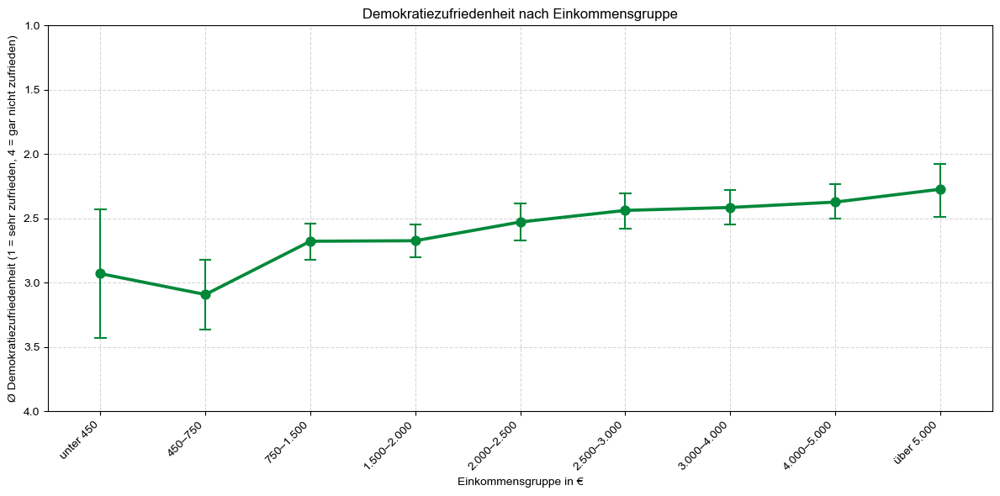

# Intensivnutzung sozialer Medien: Interesse, Vertrauen und Demokratiezufriedenheit

Dieses Repository enthält die offizielle Analyse unseres Projekts **"Intensivnutzung sozialer Medien: Interesse, Vertrauen und Demokratiezufriedenheit"**, das im Rahmen des Kurses **Datenverarbeitung in der angewandten Medienforschung** mit Daten des [GESIS-Datensatzes „Intensivnutzer sozialer Medien“ (ZA6720)](https://search.gesis.org/research_data/ZA6720) durchgeführt wurde.

Wir untersuchen, welchen Einfluss die **Nutzungsweise sozialer Medien** und **soziodemografische Merkmale** (wie Alter, Geschlecht, Bildung oder Einkommen) auf demokratiefördernde Einstellungen haben – insbesondere:

- **Politisches Interesse**
- **Vertrauen in politische Inhalte**
- **Demokratiezufriedenheit**

---

## Anforderungen

Alle benötigten Abhängigkeiten können mit folgendem Befehl installiert werden:

```bash
pip install -r requirements.txt
```

---

## Projektstruktur

```
.
├── Project_Intensivnutzung.ipynb # Gesamtes Python Projekt
├── README.md # Projektbeschreibung
├── requirements.txt # Benötigte Python-Pakete
├── figures/ # Auszug relevanter Visualisierungen
│ ├── karte_anteile_bundeslaender.png # Anteil Teilnehmender je Bundesland
│ ├── mediennutzung_pol_interesse.png # Mediennutzung & politisches Interesse
│ └── demokratiezufriedenheit.png #Demokratiezufriedenheit & Einkommen
```

---

## Datengrundlage

- 🗓 **Erhebungszeitraum:** 19.04.2018 – 03.05.2018  
- 🌍 **Untersuchungsgebiet:** Deutschland  
- 👥 **Stichprobengröße:** 1.008 Befragte (ab 16 Jahren)  
- 📋 **Befragungsmodus:** Selbst auszufüllender Online-Fragebogen  
- 📊 **Variablenanzahl:** 175  

Datenquelle: [GESIS – ZA6720 „Intensivnutzer sozialer Medien“](https://search.gesis.org/research_data/ZA6720)

---
## Visualisierungen (Auszug)

### Verteilung der Teilnehmer:innen nach Bundesland

Anteil der Befragten je Bundesland in relativen Häufigkeiten

<p align="center">
  
</p>

---

### Nutzung klassischer Medien & politisches Interesse

Untersuchung des Zusammenhangs zwischen politischem Interesse und klassischer Mediennutzung

<p align="center">
  
</p>

---

### Demokratiezufriedenheit & Einkommen

Untersuchung der Demokratiezufriedenheit nach Einkommensgruppen

<p align="center">
  
</p>

---

## Analyseschwerpunkte

- 📊 **Deskriptive Auswertungen**: Soziodemografische Struktur der Stichprobe
- 🤼 **Gruppenvergleiche**: z. B. Demokratiezufriedenheit nach Bildung
- 📈 **Korrelationen**: Zusammenhang von politischem Interesse und Nutzung klasssischer Medien
- 🎻 **Visualisierung**: u. a. mit Balken-, Violin- und Kartenplots

## Wesentliche Erkenntnisse

- Politisches Interesse steigt mit zunehmendem Alter, ist bei Männern höher ausgeprägt und nimmt mit steigendem Bildungsgrad zu.
- Personen, die sich in sozialen Netzwerken politisch engagieren (politische Beiträge posten, liken, kommentieren oder teilen ), sind tendenziell politisch interessierter.
- Personen, die soziale Medien zur politischen Information & Diskussion nutzen, sind tendenziell politisch interessierter.
- Personen, die häufiger klassische Medien (Fernsehen, Zeitung, Radio) nutzen, sind tendenziell politisch interessierter. 
- Je häufiger Personen auf sozialen Medien mit politischen Informationen in Kontakt kommen, desto höher ist das Vertrauen in politische Inhalte in sozialen Medien und desto besser bewerten sie die Glaubwürdigkeit dieser Inhalte.
- Demokratiezufriedenheit steigt mit höherem Einkommen und einem höheren Bildungsgrad.


---

## Hinweise

Dieses Projekt ist Teil eines universitären Forschungsprojekts und dient ausschließlich zu Analyse- und Lernzwecken.   
