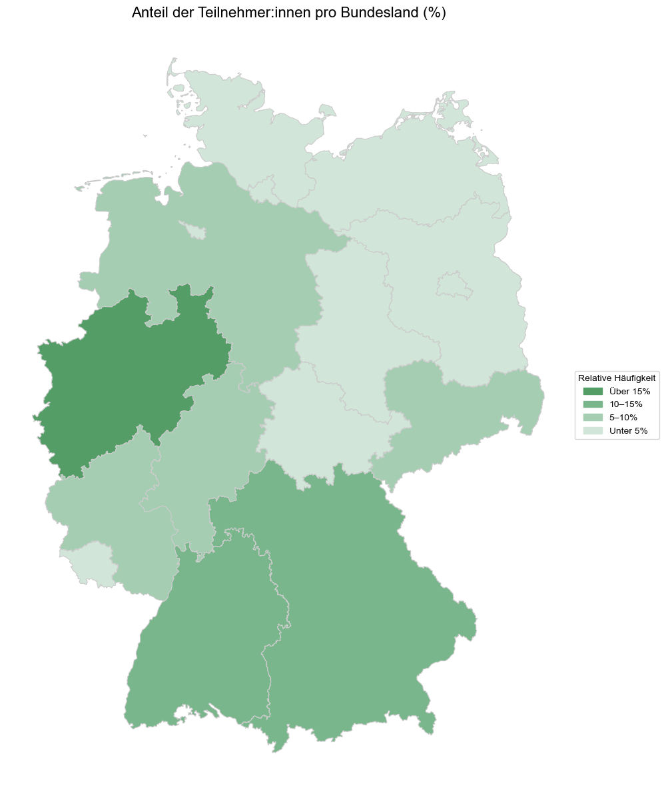
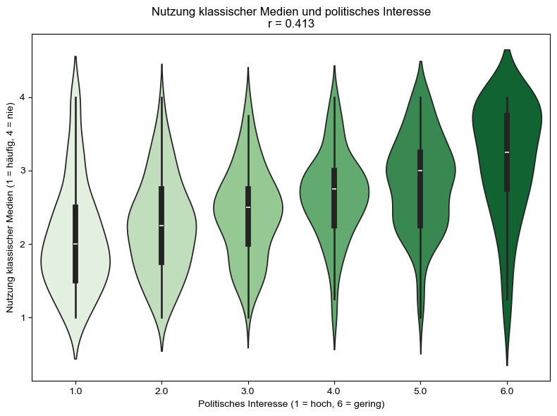

# Nutzung sozialer Medien, Demokratiezufriedenheit & Soziodemografie

Dieses Repository enthält die offizielle Analyse unseres Projekts **"Politisches Interesse, Vertrauen in politische Inhalte und Demokratiezufriedenheit"**, durchgeführt mit Daten des [GESIS-Datensatzes „Intensivnutzer sozialer Medien“ (ZA6720)](https://search.gesis.org/research_data/ZA6720) im Rahmen des Kurses **Datenverarbeitung in der angewandten Medienforschung**.

Wir untersuchen, welchen Einfluss die **Nutzungsweise sozialer Medien** und **soziodemografische Merkmale** (wie Alter, Geschlecht, Bildung oder Einkommen) auf demokratiefördernde Einstellungen haben – insbesondere:

- **Politisches Interesse**
- **Vertrauen in politische Inhalte**
- **Demokratiezufriedenheit**

---

## Anforderungen

Alle benötigten Abhängigkeiten können mit folgendem Befehl installiert werden:

```bash
pip install -r requirements.txt
```

---

## Projektstruktur

```
.
├── Project_Intensivnutzung.ipynb # Gesamtes Python Projekt
├── README.md # Projektbeschreibung
├── requirements.txt # Benötigte Python-Pakete
├── figures/ # Auszug relevanter Visualisierungen
│ ├── karte_anteile_bundeslaender.png # Anteil Teilnehmender je Bundesland
│ ├── mediennutzung_pol_interesse.png # Mediennutzung & politisches Interesse
│ └── etc.
```

---

## Datengrundlage

- 🗓 **Erhebungszeitraum:** 19.04.2018 – 03.05.2018  
- 🌍 **Untersuchungsgebiet:** Deutschland  
- 👥 **Stichprobengröße:** 1.008 Befragte (ab 16 Jahren)  
- 📋 **Befragungsmodus:** Selbst auszufüllender Online-Fragebogen  
- 📊 **Variablenanzahl:** 175  

Datenquelle: [GESIS – ZA6720 „Intensivnutzer sozialer Medien“](https://search.gesis.org/research_data/ZA6720)

---
## Visualisierungen (Auszug)

### Verteilung der Teilnehmenden nach Bundesland

Anteil der Befragten je Bundesland in relativen Häufigkeiten.

<p align="center">
  
</p>

---

### Nutzung klassischer Medien & politisches Interesse

Untersuchung des Zusammenhangs zwischen politischem Interesse und klassischer Mediennutzung.

<p align="center">
  
</p>

---

## Analyseschwerpunkte

- **Deskriptive Auswertungen**: Soziodemografische Struktur der Stichprobe
- **Gruppenvergleiche**: z. B. Demokratiezufriedenheit nach Bildung, Einkommen, Mediennutzung
- **Korrelationen**: Zusammenhang von politischem Interesse und Mediennutzung
- **Visualisierung**: u. a. mit Balken-, Violin- und Kartenplots

## Wesentliche Erkenntnisse

- tbd


---

## Hinweise

Dieses Projekt ist Teil eines universitären Forschungsprojekts und dient ausschließlich zu Analyse- und Lernzwecken.  
